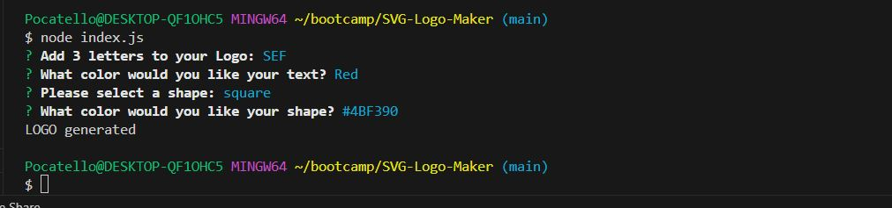
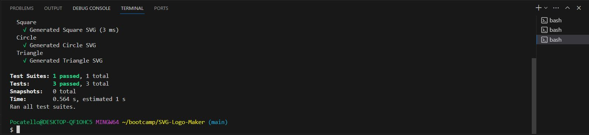

# SVG Logo Generator

  

## Description

Need a quick logo made? Dont want to pay for a expensive graphic designer, when all you need is a simple shape with 3 letters? Thats where the SVG logo generator comes in handy! This application generates a super simple SVG file with a shape and letters of the users choice to be used as a makeshift logo.

## Table of Contents (Optional)

If your README is long, add a table of contents to make it easy for users to find what they need.

- [Installation](#installation)
- [Usage](#usage)
- [Credits](#credits)
- [License](#license)

## Installation

Dowload, copy, or clone the code to your local machine through GitHub. When the code is launched in vscode, or another approperate IDE, open an terminal on the index.js file and type "node index.js" to begin theapplication.

## Usage

Vide demonstration of usage: https://youtu.be/n4HdYgGWWuk

After following the installation steps the user will then be prompted a series of questions about the style of their logo. Once all questions are awnsered a SVG file will be generated in creating the logo to match the users prompt inputs.

## License

This application is covered under Unlicense license.

## Features

This applciation features the use of node.js, specifically Inquirer 8.2.4 to prompt the user with a variety of questions in the terminal. Aditionally it uses fs to write the SVG file based on the users input from Inquirer.

## Tests

Three tests can be ran to verify that each shape is generated in the correct format for svg files, by typing "npm run test" in the integrated terminal.

## Questions

Any questions please reachout at: samuelfullerca@gmail.com

To view additional applications developed by myself, checkout my GitHub profile: SamuelFullerCA